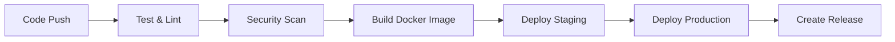

README made using AI, checked for accuracy
# JWT Authentication API

A secure, production-ready JWT authentication system with comprehensive security features, logging, and CI/CD pipeline.

## 🚀 Features

- **🔐 JWT Authentication** - Secure token-based authentication
- **🛡️ Security** - Rate limiting, security headers, CSP protection
- **📊 Logging** - Comprehensive logging with Winston and Morgan
- **🐳 Docker** - Containerized for easy deployment
- **📚 Documentation** - Interactive API documentation with Swagger
- **🔄 CI/CD** - Automated testing, building, and deployment
- **🎨 Modern UI** - Beautiful dark-themed frontend

## 🏗️ Architecture

```
jwtapi-demo/
├── server.js              # Main server with security middleware
├── logger.js              # Winston logging configuration
├── view-logs.js           # Log viewer utility
├── routes/
│   ├── auth.js           # Authentication routes
│   └── protected.js      # Protected routes
├── public/               # Frontend files
├── logs/                 # Log files directory
├── .github/workflows/    # CI/CD workflows
├── Dockerfile            # Production container
├── docker-compose.yml    # Production orchestration
└── docs/                 # Documentation
```

## 🚀 Quick Start

### Prerequisites
- Node.js 18+
- Docker (optional)
- Git

### Local Development
```bash
# Clone the repository
git clone <your-repo-url>
cd jwtapi-demo

# Install dependencies
npm install

# Set up environment
cp .env.example .env
# Edit .env with your JWT_SECRET

# Start development server
npm run dev
```

### Docker Development
```bash
# Development with hot reload
docker-compose -f docker-compose.dev.yml up

# Production
docker-compose up -d
```

## 🔗 URLs

- **Frontend:** http://localhost:3000
- **API Documentation:** http://localhost:3000/api-docs
- **Docs Redirect:** http://localhost:3000/docs

## 🔐 Test Users

| Username | Password | Description |
|----------|----------|-------------|
| `admin`  | `admin123` | Administrator account |
| `user`   | `password123` | Regular user account |
| `demo`   | `demo123` | Demo account |

## 📊 Logging

### View Logs
```bash
# Using the log viewer script
node view-logs.js combined 20
node view-logs.js error 10
node view-logs.js debug 30 "admin"

# Direct file access
tail -f logs/combined.log
grep "login_success" logs/combined.log
```

### Log Files
- `logs/combined.log` - All logs (info level and above)
- `logs/error.log` - Error logs only
- `logs/debug.log` - Debug logs (most detailed)

## 🔄 CI/CD Pipeline

### Workflows

#### 1. **Main CI/CD Pipeline** (`.github/workflows/ci-cd.yml`)
- **Triggers:** Push to main/develop, PRs, releases
- **Jobs:**
  - ✅ **Test & Lint** - Code quality checks
  - 🔒 **Security Scan** - Vulnerability scanning with Trivy
  - 🐳 **Build** - Docker image building and pushing
  - 🚀 **Deploy Staging** - Automatic staging deployment
  - 🌐 **Deploy Production** - Production deployment
  - 📦 **Release** - GitHub release creation

#### 2. **Development Workflow** (`.github/workflows/development.yml`)
- **Triggers:** Feature branches, PRs
- **Jobs:**
  - ✅ **Code Quality** - Syntax checks, security audit
  - 🐳 **Build Test** - Docker build validation
  - 📚 **Documentation** - Doc file validation
  - 🔒 **Security Check** - Sensitive file validation

#### 3. **Deployment Workflow** (`.github/workflows/deploy.yml`)
- **Triggers:** Manual deployment, tags
- **Features:**
  - 🎯 **Environment Selection** - Choose staging/production
  - 🔄 **Auto-deployment** - Based on branch
  - 🏥 **Health Checks** - Post-deployment validation

### Pipeline Stages



### Branch Strategy

- **`main`** → Production deployment
- **`develop`** → Staging deployment
- **`feature/*`** → Development workflow only
- **`v*` tags** → Release creation

## 🛠️ Setup CI/CD

### 1. GitHub Repository Setup

```bash
# Initialize git (if not already done)
git init
git add .
git commit -m "Initial commit with CI/CD"

# Create repository on GitHub
# Then push your code
git remote add origin <your-github-repo-url>
git push -u origin main
```

### 2. GitHub Secrets (Optional)

For advanced deployments, add these secrets in your GitHub repository:

- `DOCKER_USERNAME` - Docker Hub username
- `DOCKER_PASSWORD` - Docker Hub password
- `SLACK_WEBHOOK_URL` - Slack notifications
- `DEPLOY_SSH_KEY` - SSH key for server deployment
- `DEPLOY_HOST` - Deployment server hostname

### 3. Environment Protection

Set up environment protection rules in GitHub:
- **Staging:** Require PR approval
- **Production:** Require PR approval + status checks

## 🚀 Deployment Options

### 1. **Docker Compose** (Recommended for small projects)
```bash
# Production
docker-compose up -d

# Staging
docker-compose -f docker-compose.staging.yml up -d
```

### 2. **Kubernetes** (For larger projects)
```bash
# Apply Kubernetes manifests
kubectl apply -f k8s/
```

### 3. **Cloud Platforms**
- **AWS ECS/Fargate**
- **Google Cloud Run**
- **Azure Container Instances**
- **DigitalOcean App Platform**

## 📈 Monitoring & Observability

### Health Checks
```bash
# Application health
curl http://localhost:3000/health

# Docker health
docker ps --format "table {{.Names}}\t{{.Status}}"
```

### Metrics
- **Response Times** - Logged automatically
- **Error Rates** - Tracked in error.log
- **Authentication Events** - Security monitoring
- **Rate Limiting** - Abuse detection

## 🔧 Configuration

### Environment Variables
```bash
# Required
JWT_SECRET=your-super-secret-jwt-key-change-this-in-production
PORT=3000

# Optional
NODE_ENV=production
LOG_LEVEL=info
```

### Docker Configuration
```bash
# Production
docker-compose up -d

# Development
docker-compose -f docker-compose.dev.yml up

# Custom environment
docker-compose -f docker-compose.yml -f docker-compose.override.yml up
```

## 🧪 Testing

### Manual Testing
```bash
# Test authentication
curl -X POST http://localhost:3000/auth/login \
  -H "Content-Type: application/json" \
  -d '{"username": "admin", "password": "admin123"}'

# Test protected endpoint
curl -X GET http://localhost:3000/protected \
  -H "Authorization: Bearer <your-token>"
```

### Automated Testing (Future)
```bash
# Run tests
npm test

# Run with coverage
npm run test:coverage
```

## 📚 API Documentation

- **Interactive Docs:** http://localhost:3000/api-docs
- **API Reference:** [API_DOCUMENTATION.md](API_DOCUMENTATION.md)
- **Project Notes:** [PROJECT_NOTES.md](PROJECT_NOTES.md)

## 🔒 Security Features

- ✅ **Rate Limiting** - 3 layers of protection
- ✅ **Security Headers** - Helmet.js protection
- ✅ **Content Security Policy** - XSS prevention
- ✅ **JWT Expiration** - 1-hour token lifetime
- ✅ **Input Validation** - All inputs validated
- ✅ **Logging** - Security event tracking

## 🤝 Contributing

1. Fork the repository
2. Create a feature branch (`git checkout -b feature/amazing-feature`)
3. Commit your changes (`git commit -m 'Add amazing feature'`)
4. Push to the branch (`git push origin feature/amazing-feature`)
5. Open a Pull Request

## 📄 License

This project is licensed under the MIT License - see the [LICENSE](LICENSE) file for details.

## 🆘 Support

- **Documentation:** Check the docs folder
- **Issues:** Create a GitHub issue
- **Discussions:** Use GitHub Discussions

---

**Built with ❤️ using Node.js, Express, and modern DevOps practices**

